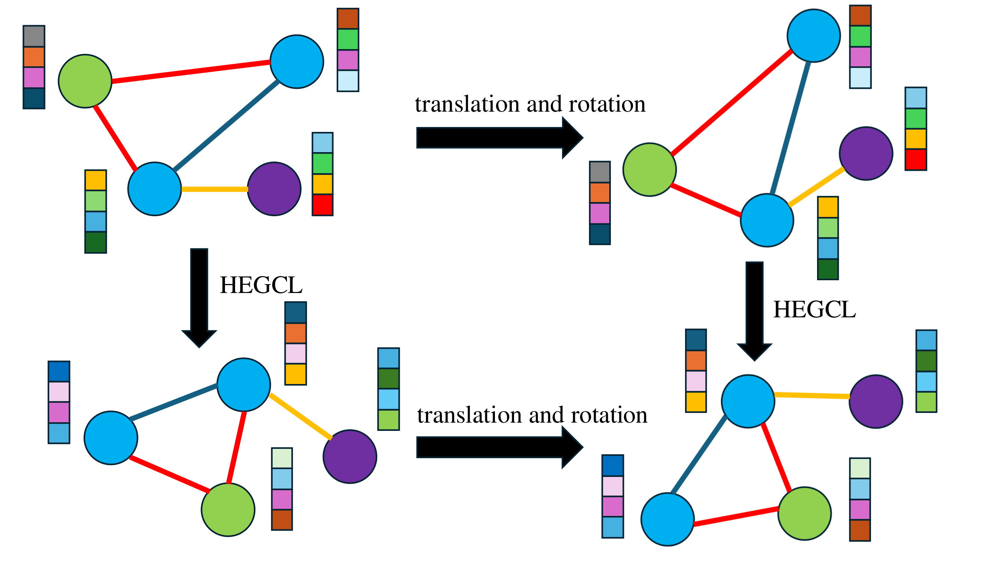

# HEGNN
We propose Heterogeneous Equivariant Graph Neural Networks (HEGNNs). This model is designed for heterogeneous graphs with edge associated features and node coordinates. HEGNNs are capable of capturing complex and diverse relationships in graphs while preserving the equivariance properties with respect to geometric transformations. By incorporating node and edge heterogeneity into the model design, HEGNNs can learn by considering the spatial relationships between different types of nodes. Moreover, the equivariant properties allow it to generalize effectively to graphs with similar spatial relationships in different regions.

    

The figure shows the illustration of equivariance. The colors of the nodes and edges correspond to the node and edge types, respectively. The color of the blocks corresponds to the embedding representation of each node. When HEGCL is applied, the node embedding representations remain consistent even after transformations such as translation and rotation are applied. In addition, the node coordinates of the graph where the coordinate transformation is applied after HEGCL is applied are the same as those of the graph where HEGCL is applied first and the transformation is applied afterwards.